<!-- README.md is generated from README.Rmd. Please edit that file -->

# Anaemia in pregnancy in a rural health facility in central district of Ghana <a href="https://amicusonlus.org/" target="_blank"></a> <a href="https://www.tropicalmedicine.ox.ac.uk/study-with-us/msc-ihtm" target="_blank"></a>

<!-- badges: start -->

[-GPL3.0-blue.svg)](https://opensource.org/licenses/gpl-3.0.html)
-restricted-red)
<!-- badges: end -->

This repository is a
[`docker`](https://www.docker.com/get-started)-containerised,
[`{targets}`](https://docs.ropensci.org/targets/)-based,
[`{renv}`](https://rstudio.github.io/renv/articles/renv.html)-enabled
[`R`](https://cran.r-project.org/) workflow for the project on *Anaemia
in pregnancy in a rural health facility in central district of Ghana*.

## About the Project

This is a descriptive study that aims to determine the burden and
determinants of anaemia among pregnant women attending the antenatal
clinic at a rural health facility in the Central District of Ghana. The
targeted population for the study consists of all pregnant women who
received antenatal care (ANC) at [Biriwa Baobab Medical
Centre](https://amicusonlus.org/the-baobab-medical-center), a rural
clinic in the Central District of Ghana.

Ghana divides healthcare providers into five levels: 1) health posts,
which provide primary care in rural areas; 2) health centres and
clinics; 3) district hospitals; 4) regional hospitals; and 5) tertiary
hospitals. Biriwa Baobab Medical Centre is a “health centre and clinic”
that mostly serves the nearby communities. It has several departments,
including maternal units, the Outpatient Department (OPD), the emergency
room (ER), the pharmacy, the lab, and the registration unit. There is
one physical assistant and three nurses responsible for OPD, the ward,
and the ER. A staff member handles registration, a pharmacist manages
the pharmacy, two technicians handle the lab, two midwives oversee the
maternal unit, and the manager manages everything in the medical centre.
The maternal unit is their primary source of income. The maternal unit
primarily generates revenue from the provision of antenatal care (ANC),
delivery, and postnatal care (PNC). The ANC unit registers around 270
pregnant women annually and conducts 30 ANC visits each month.

The study encompasses pregnant women who received antenatal care (ANC)
at Biriwa Baobab Medical Centre in 2023 and early 2024. The study
excludes pregnant women who do not have digital medical records.

## Repository Structure

The project repository is structured as follows:

    gh-anaemia-pregnancy
        |-- .github/
        |-- data/
        |-- data-raw/
        |-- inst/
        |-- metadata/
        |-- outputs/
        |-- R/
        |-- reports
        |-- renv
        |-- renv.lock
        |-- .Rprofile
        |-- packages.R
        |-- _targets.R

  - `.github` contains workflows for project testing and automated
    deployment of outputs via continuous integration and continuous
    deployment (CI/CD) using Github Actions.

  - `data/` contains intermediate and final data outputs produced by the
    workflow. This directory is empty given that data outputs from this
    project are restricted and can only be reproduced by eligible
    members of the project. This directory is kept here to maintain
    reproducibility of project directory structure and ensure that the
    workflow runs as expected. Those who are collaborating on this
    project and who have permissions to use the raw datasets (see next
    point) should run the workflow as described below in the section on
    [Reproducibility](#reproducibility) to generate the data outputs of
    this project.

  - `data-raw/` contains raw datasets, usually either downloaded from
    source or added manually, that are used in the project. This
    directory is empty given that the raw datasets used in this project
    are restricted and are only distributed to eligible members of the
    project. This directory is kept here to maintain reproducibility of
    project directory structure and ensure that the workflow runs as
    expected. Those who are collaborating on this project and who have
    permissions to use the raw datasets should include their copies of
    the raw dataset into this directory in their local versions of this
    repository.

  - `inst/` contains loose R scripts and outputs developed during code
    development and testing. These are not used in the workflow but are
    archived here for reference purposes.

  - `metadata/` contains various metadata for both raw and processed
    datasets found in the `data-raw` and `data` directories.

  - `outputs/` contains compiled reports, tables, and figures produced
    by the workflow.

  - `R/` contains functions developed/created specifically for use in
    this workflow.

  - `reports/` contains literate code for R Markdown reports rendered in
    the workflow.

  - `renv/` contains `renv` package specific files and directories used
    by the package for maintaining R package dependencies within the
    project. The directory `renv/library`, is a library that contains
    all packages currently used by the project. This directory, and all
    files and sub-directories within it, are all generated and managed
    by the `renv` package. Users should not change/edit these manually.

  - `renv.lock` file is the `renv` lockfile which records enough
    metadata about every package used in this project that it can be
    re-installed on a new machine. This file is generated by the `renv`
    package and should not be changed/edited manually.

  - `.Rprofile` file is a project R profile generated when initiating
    `renv` for the first time. This file is run automatically every time
    R is run within this project, and `renv` uses it to configure the R
    session to use the `renv` project library.

  - `packages.R` file lists out all R package dependencies required by
    the workflow.

  - `_targets.R` file defines the steps in the workflow’s data ingest,
    data processing, data analysis, and reporting pipeline.

## Reproducibility

### R package dependencies

This project was built using `R 4.4.1`. This project uses the `{renv}`
package framework to record R package dependencies and versions.
Packages and versions used are recorded in `renv.lock` and code used to
manage dependencies is in `renv/` and other files in the root project
directory. On starting an R session in the working directory, run
`renv::restore()` to install R package dependencies.

On starting an R session in the working directory, run

``` r
renv::restore()
```

to install this project’s R package dependencies.

### Running the workflow

The current project workflow is described in the image below:

``` mermaid
graph LR
  style Graph fill:#FFFFFF00,stroke:#000000;
  subgraph Graph
    direction LR
    xbba39ca9e518ed94(["anc_data_raw"]):::uptodate --> x597caed207d4fc5d(["anc_data_processed"]):::uptodate
    x05812169c4dfa932(["anc_data_raw_file"]):::uptodate --> xbba39ca9e518ed94(["anc_data_raw"]):::uptodate
    x597caed207d4fc5d(["anc_data_processed"]):::uptodate --> x34a9c3203c3a0d4e(["anc_data_raw_review_report"]):::uptodate
    x34b86f86bb8014ea(["anc_data_processed_metadata"]):::uptodate --> x34a9c3203c3a0d4e(["anc_data_raw_review_report"]):::uptodate
    xbba39ca9e518ed94(["anc_data_raw"]):::uptodate --> x34a9c3203c3a0d4e(["anc_data_raw_review_report"]):::uptodate
    x8a8877168229f4dd(["anc_data_raw_metadata"]):::uptodate --> x34a9c3203c3a0d4e(["anc_data_raw_review_report"]):::uptodate
    xa2691830171b0cf9(["anc_data_recode"]):::uptodate --> x83b06018b27c1391(["anc_data_summary_bivariate_table"]):::uptodate
    x9265d4ebfbcc5e37(["anc_gaussian_model_summary"]):::uptodate --> x8f6836dcac596e4d(["anc_model_outputs"]):::uptodate
    x2d44714c6076aea5(["anc_logit_model_summary"]):::uptodate --> x8f6836dcac596e4d(["anc_model_outputs"]):::uptodate
    x2d1d696496197875(["anc_odds_ratio_table"]):::uptodate --> x8f6836dcac596e4d(["anc_model_outputs"]):::uptodate
    x02d4c90c16108e87(["anc_t_test_table"]):::uptodate --> x8f6836dcac596e4d(["anc_model_outputs"]):::uptodate
    x8a8877168229f4dd(["anc_data_raw_metadata"]):::uptodate --> x2f4ef36220e6f123(["anc_data_raw_metadata_csv"]):::uptodate
    x597caed207d4fc5d(["anc_data_processed"]):::uptodate --> x9efa48e5541103b9(["anc_data_processed_csv"]):::uptodate
    xa2691830171b0cf9(["anc_data_recode"]):::uptodate --> xc84eb75d2309c0e2(["anc_data_model_recode"]):::uptodate
    xc84eb75d2309c0e2(["anc_data_model_recode"]):::uptodate --> x22e570cd18c3f66c(["anc_bivariate_t_test"]):::uptodate
    x6262f74751558db7(["anc_data_model"]):::uptodate --> x11c78e49bf183f4f(["anc_data_model_csv"]):::uptodate
    x2d826175fca676e3(["anc_gaussian_model"]):::uptodate --> x9265d4ebfbcc5e37(["anc_gaussian_model_summary"]):::uptodate
    xbba39ca9e518ed94(["anc_data_raw"]):::uptodate --> x8a8877168229f4dd(["anc_data_raw_metadata"]):::uptodate
    xa2691830171b0cf9(["anc_data_recode"]):::uptodate --> x4e5d056abbac74dc(["anc_data_analysis_report"]):::outdated
    xc84eb75d2309c0e2(["anc_data_model_recode"]):::uptodate --> x77712cf549a15628(["anc_bivariate_fisher_test"]):::uptodate
    xc84eb75d2309c0e2(["anc_data_model_recode"]):::uptodate --> x6262f74751558db7(["anc_data_model"]):::uptodate
    x34b86f86bb8014ea(["anc_data_processed_metadata"]):::uptodate --> x2d4384c638b4d284(["anc_data_processed_metadata_csv"]):::uptodate
    x597caed207d4fc5d(["anc_data_processed"]):::uptodate --> xa2691830171b0cf9(["anc_data_recode"]):::uptodate
    xa2691830171b0cf9(["anc_data_recode"]):::uptodate --> xdeea979a9fc8283c(["anc_data_summary_univariate_table"]):::uptodate
    x597caed207d4fc5d(["anc_data_processed"]):::uptodate --> x34b86f86bb8014ea(["anc_data_processed_metadata"]):::uptodate
    x22e570cd18c3f66c(["anc_bivariate_t_test"]):::uptodate --> x02d4c90c16108e87(["anc_t_test_table"]):::uptodate
    xec336fb433299b8a(["anc_logit_model"]):::uptodate --> x2d44714c6076aea5(["anc_logit_model_summary"]):::uptodate
    xc84eb75d2309c0e2(["anc_data_model_recode"]):::uptodate --> x60423dd0fbb1026b(["anc_data_model_recode_csv"]):::uptodate
    x6262f74751558db7(["anc_data_model"]):::uptodate --> xec336fb433299b8a(["anc_logit_model"]):::uptodate
    x6262f74751558db7(["anc_data_model"]):::uptodate --> x2d826175fca676e3(["anc_gaussian_model"]):::uptodate
    x77712cf549a15628(["anc_bivariate_fisher_test"]):::uptodate --> x2d1d696496197875(["anc_odds_ratio_table"]):::uptodate
    xa1f8e339ffb46424(["anc_study_dag"]):::outdated --> xa1f8e339ffb46424(["anc_study_dag"]):::outdated
  end
```



To run the entire workflow as specified in the current version of the
project, run

``` r
targets::tar_make()
```

from the R console.

You can also run the entire workflow from the command line/Terminal as
follows:

``` bash
Rscript -e "targets::tar_make()"
```

Running specific components of the workflow usually involves specifying
a target name or target names of the components you want to run.
Usually, you should be able to run a full workflow path by just
specifying the name of the last target in the workflow sequence. For
example, the following will run just the *model analysis workflow*:

``` r
targets::tar_make(anc_model_outputs)
```

The target `anc_model_outputs` is the last target of a series of linked
model analysis targets. Hence, to be able to produce the
`anc_model_outputs` target requires running this series of linked
targets.

If you would like to run a set of interrelated but not fully linked
targets, you will likely need to specify more than one target name. For
this, you can use `tidyselect` approaches to name targets to be run. For
example:

``` r
targets::tar_make(dplyr::contains("model"))
```

will run all targets (and their linked targets) whose names contain
*“model”*.

## Project Team

  - Shih-Ting Tseng - University of Oxford
  - Proochista Ariana - University of Oxford
  - Caesar Atuire - University of Oxford/Biriwa Baobab Medical Centre

## Licenses

All code created through this project (found in this repository) is
released under a [GPL-3.0
license](https://opensource.org/licenses/gpl-3.0.html).

Antenatal care (ANC) data used in this project (not available through
this repository) is restricted to those granted permission to use the
data.

<br> <br>
